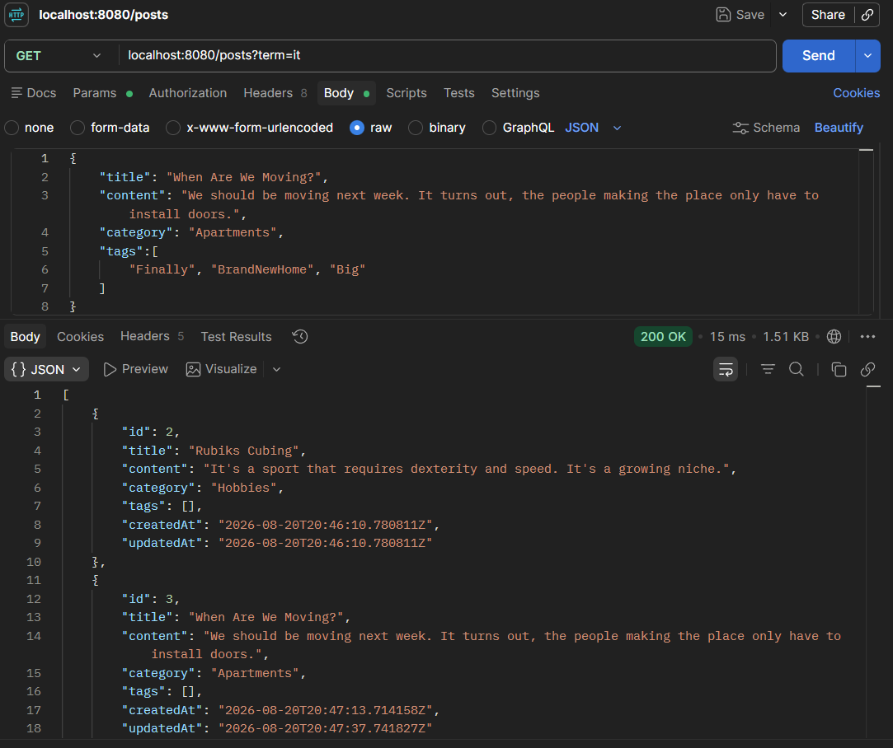
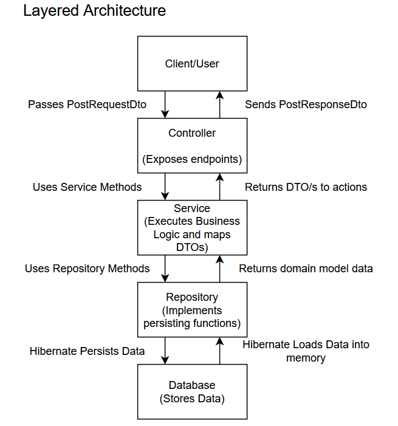

# Blogging Platform API Migrated
RESTful CRUD API built with Spring Boot, Spring Data JPA, and PostgreSQL. My second take on
the [Blogging Platform API](https://roadmap.sh/projects/blogging-platform-api) beginner project
from [roadmap](https://roadmap.sh/).

## Technologies used
- **Language:** Java 17+
- **Database:** PostgreSQL 18+
- **Database Access:** Spring Data JPA

## Key Technical Insights
- Migrated from Spring Data JDBC to Spring Data JPA
- Used ```FETCH``` keyword in JPQL query for a custom function to mitigate the N+1 problem.
- Used ```@ElementCollection``` annotation instead of Java's primitive array type to allow JPQL querying for portability.
- Applied Integration Testing to confirm functions and cover edge cases.
- Used ```@ExceptionHandler``` for global exception handling.

## Prerequisites
- **Java Development Kit (JDK 17+)**
- **PostgreSQL 18+** for the database
- **Maven** as the build tool
- **Postman** or **cURL** for API testing

## Installation Guide
1. Clone the GitHub repository and head over to the project folder
```shell
git clone https://github.com/raafiAbdul/blogging-platform-api-migrated.git
cd blogging-platform-api-migrated
```
2. Configure your environment variables
```
DB_URL = jdbc:postgresql://localhost:5432/mydb
DB_USERNAME = your_username
DB_PASSWORD = your_password
```
3. Run the application
**On Windows**
```shell
.\mvnw.cmd spring-boot:run
```
**On macOS/Linux**
```bash
./mvnw spring-boot:run
```

## API Endpoints
- ```POST /posts``` Creates a new post
- ```PUT /posts/{id}``` Updates a blog post
- ```DELETE /posts/{id}``` Deletes a blog post
- ```GET /posts``` Retrieves all blog posts
- ```GET /posts/{id}``` Finds the blog post with that id
- ```GET /posts?term={keyword}``` Finds posts with said keyword

## Sample Usage and Diagrams
### Creating a Blog

```POST /posts```
```json
{
  "title": "First Blog Post of the Day",
  "content": "Hello guys, I hope you are having a wonderful day.",
  "category": "Relaxing",
  "tags": ["First", "Second", "Third", "..."]
}
```
```201 Created```

### Violating Constraints

```DELETE /posts/999```
```json
{
  "details": "No such post with id: 999"
}
```
```404 Not Found```

### Postman Sample

### API Architecture Diagram


## Contributions
Contributions, feedback, and issue reports are very welcome! 
Feel free to open a Pull Request or issue if you have suggestions for code optimization or architectural improvements.

